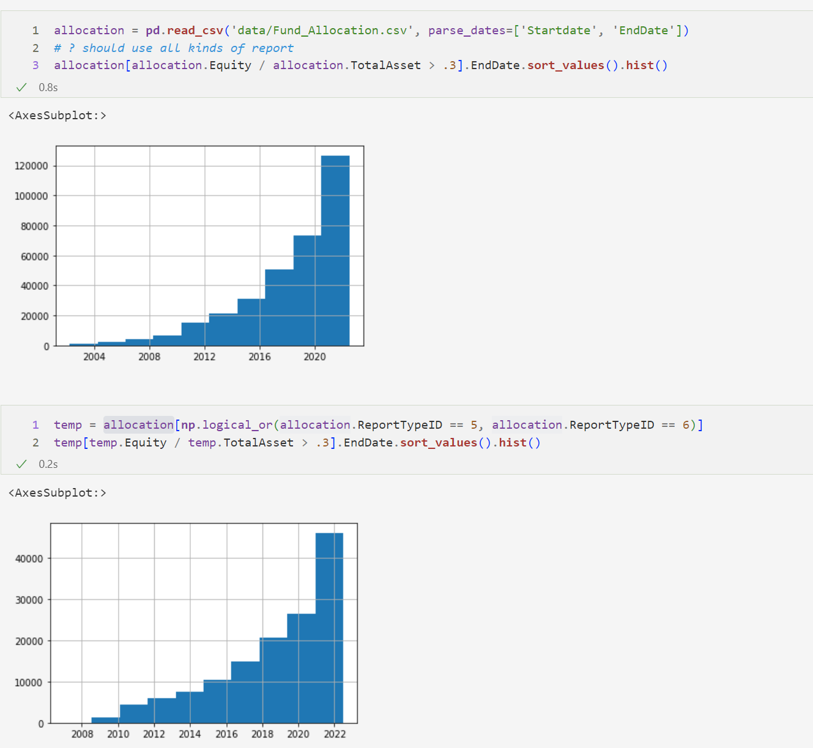

#### 预处理

FUND_MainInfo基金概况 — 基金主体信息表

* 不含Symbol，含有MasterFundCode
* 含有类型分类：20%股票型基金/40%混合型基金/30%债券型基金/...
* 含有ETF分类：93%非ETF
* 含有QDII分类：98%非QDII
* 含有主被动分类：50%主动/20%被动/...（30%空）

FUND_UnitClassInfo基金概况 — 基金份额类别信息

* 含有Symbol，含有MasterFundCode
* 含有InceptionDate
* 以Symbol为键，合并FUND_MainInfo与FUND_UnitClassInfo，得到新的FUND_MainInfo

#### 普通筛选

（1）基金类别必须为“股票型基金”或“混合型基金”；

（2）非 ETF 类基金；

（3）非 QDII 类基金；

（4）主动管理标识为 1 或者为空；

前四个条件筛选

|       | share            | nav            |
| ----- | ---------------- | -------------- |
| stock | stock fund share | stock fund nav |
| mixed | mixed fund share | mixed fund nav |

单独筛选情况下，四个单独的条件分别能保留下来0.619, 0.955 , 0.974, 0.832的数据

连续筛选情况下，

filter 1: 18915 to 11710, 38.09% symbols dropped
filter 2: 11710 to 10969, 6.33% symbols dropped
filter 3: 10969 to 10654, 2.87% symbols dropped
filter 4: 10654 to 8786, 17.53% symbols dropped

#### 动态筛选

用Symbol和季度时间交错，建立大表

以Symbol为键，合并大表与预处理中新的FUND_MainInfo，在此过程中保留FUND_MainInfo的InceptionDate_y、MasterFundCode、Category信息

完成（5）基金上市时间超过一年的筛选

不存在2007年前满足条件（6）的基金

