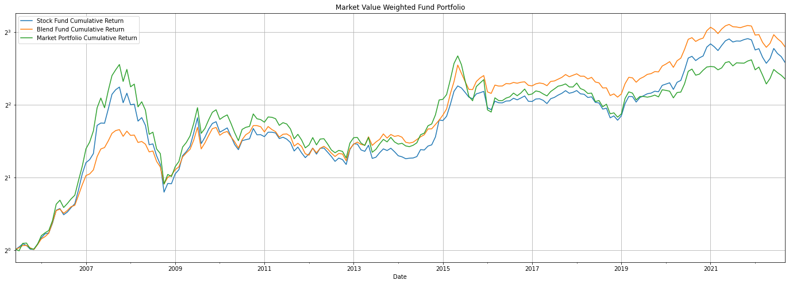
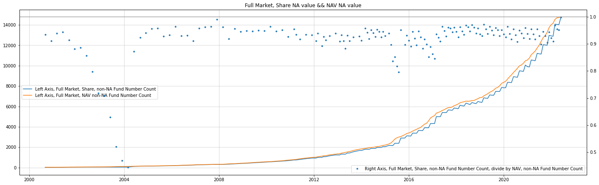
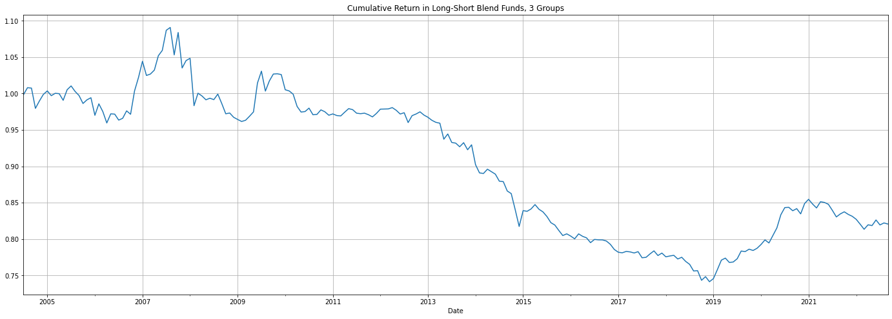

## **I. Data**

**Research**

- Most Data (nav/dividend/split ratio/asset allocation) : `CSMAR`
- Fund classification : `JoinQuant`
- Fund start date: `JoinQuant`

**Validation**

- `AMAC` : [2020 yearly report, page 15](https://www.amac.org.cn/researchstatistics/publication/zgzqtzjjynb/202104/t20210419_11390.html), for market statistic
- `Win.d` : classification/share/nav, for market statistic; stock fund adjusted net asset value (2005/6-2019/6)

**Data is sound, carefully verified and available to fetch**

## **II. Market Statistic**

### 2022-10, proportion of funds

### statistic at the end of June

## **III. Market Return**

### return formula definition

$$
R_t^{real}=\frac{\left(NAV_t+Div_t\right)*s_t}{NAV_{t-1}}\tag{2}
$$

$NAV_t$ denotes net asset value of month t

$Div_t$ denotes dividend payout in month t

$s_t$ denotes split ratio in month t

### cumulative return

### return description

Volatility

Return

### regress with market

| 2005/6-2022/9       | α    | t     | p     | annual α |
| ------------------- | ----- | ----- | ----- | --------- |
| stock_naïve        | 1.09% | 2.328 | 0.021 | 13.91%    |
| blend_naïve        | 1.08% | 2.93  | 0.004 | 13.71%    |
| stock_naïve_excess | 0.90% | 1.921 | 0.056 | 11.36%    |
| blend_naïve_excess | 0.89% | 2.41  | 0.017 | 11.17%    |

| 2005/6-2022/9 | α             | mktrf          | smb             | vmg             | r^2      | annual α |
| ------------- | -------------- | -------------- | --------------- | --------------- | -------- | --------- |
| stock_capm    | 0.154% (1.052) | 0.826 (44.307) |                 |                 | 0.905032 | 0.0186    |
| blend_capm    | 0.325% (2.128) | 0.62 (31.82)   |                 |                 | 0.830937 | 0.0397    |
| stock_svc     | 0.323% (2.165) | 0.838 (46.938) | -0.179 (-5.55)  | -0.024 (-0.569) | 0.919562 | 0.0395    |
| blend_svc     | 0.67% (4.294)  | 0.592 (31.72)  | -0.063 (-1.867) | -0.263 (-5.967) | 0.856929 | 0.0835    |

## **III. Overall Performance**

### last 3 years' excess return on CAPM

|         |              | group0 | group1 | group2 | group3 | group4 | long-short |
| ------- | ------------ | ------ | ------ | ------ | ------ | ------ | ---------- |
| excess  | α (monthly) | 0.94%  | 1.07%  | 1.08%  | 1.26%  | 1.21%  | 0.26%      |
|         | annual α    | 11.91% | 13.63% | 13.76% | 16.17% | 15.45% | 3.20%      |
|         | t            | 1.686  | 1.907  | 1.933  | 2.232  | 2.075  | 1.482      |
| capm α | α (monthly) | 0.09%  | 0.22%  | 0.24%  | 0.47%  | 0.38%  | 0.29%      |
|         | annual α    | 1.10%  | 2.69%  | 2.95%  | 5.80%  | 4.62%  | 3.49%      |
|         | t            | 0.646  | 1.416  | 1.41   | 1.791  | 1.52   | 1.605      |
|         | R^2          | 0.938  | 0.924  | 0.907  | 0.787  | 0.821  | 0.007      |
| svc α  | α (monthly) | 0.16%  | 0.32%  | 0.41%  | 0.52%  | 0.65%  | 0.49%      |
|         | annual α    | 1.92%  | 3.94%  | 4.97%  | 6.47%  | 8.02%  | 5.99%      |
|         | t            | 0.996  | 1.812  | 2.092  | 1.713  | 2.346  | 2.41       |
|         | R^2          | 0.942  | 0.928  | 0.914  | 0.788  | 0.839  | 0.07       |

### last 3 years' excess return on SVC

|         |              | group0 | group1 | group2 | group3 | group4 | long-short |
| ------- | ------------ | ------ | ------ | ------ | ------ | ------ | ---------- |
| excess  | α (monthly) | 0.89%  | 1.02%  | 1.07%  | 1.29%  | 1.17%  | 0.28%      |
|         | annual α    | 11.20% | 12.92% | 13.56% | 16.58% | 14.91% | 3.36%      |
|         | t            | 1.843  | 2.171  | 2.257  | 2.577  | 2.323  | 1.694      |
| capm α | α (monthly) | 0.11%  | 0.27%  | 0.32%  | 0.56%  | 0.41%  | 0.30%      |
|         | annual α    | 1.37%  | 3.28%  | 3.91%  | 6.96%  | 5.08%  | 3.66%      |
|         | t            | 0.899  | 2.01   | 2.116  | 2.274  | 1.874  | 1.833      |
|         | R^2          | 0.932  | 0.92   | 0.899  | 0.759  | 0.809  | 0.008      |
| svc α  | α (monthly) | 0.20%  | 0.46%  | 0.63%  | 0.90%  | 0.99%  | 0.79%      |
|         | annual α    | 2.42%  | 5.68%  | 7.79%  | 11.35% | 12.48% | 9.84%      |
|         | t            | 1.43   | 3.187  | 3.985  | 3.357  | 4.53   | 5.231      |
|         | R^2          | 0.933  | 0.924  | 0.911  | 0.77   | 0.85   | 0.324      |

### industry concentration

|         |              | group0 | group1 | group2 | group3 | group4 | long-short |
| ------- | ------------ | ------ | ------ | ------ | ------ | ------ | ---------- |
| excess  | α (monthly) | 0.94%  | 0.92%  | 1.02%  | 0.91%  | 0.77%  | -0.17%     |
|         | annual α    | 11.88% | 11.63% | 12.97% | 11.49% | 9.61%  | -2.05%     |
|         | t            | 2.034  | 1.999  | 2.161  | 1.973  | 1.802  | -1.21      |
| capm α | α (monthly) | 0.26%  | 0.25%  | 0.37%  | 0.24%  | 0.17%  | -0.10%     |
|         | annual α    | 3.19%  | 3.08%  | 4.50%  | 2.93%  | 2.00%  | -1.16%     |
|         | t            | 1.555  | 1.401  | 1.617  | 1.332  | 0.875  | -0.715     |
|         | R^2          | 0.87   | 0.85   | 0.774  | 0.849  | 0.808  | 0.113      |
| svc α  | α (monthly) | 0.37%  | 0.52%  | 0.49%  | 0.53%  | 0.46%  | 0.09%      |
|         | annual α    | 4.54%  | 6.37%  | 6.04%  | 6.53%  | 5.61%  | 1.03%      |
|         | t            | 1.916  | 2.55   | 1.882  | 2.692  | 2.186  | 0.555      |
|         | R^2          | 0.874  | 0.862  | 0.782  | 0.87   | 0.828  | 0.158      |

### active share

|         |              | group0 | group1 | group2 | group3 | group4 | long-short |
| ------- | ------------ | ------ | ------ | ------ | ------ | ------ | ---------- |
| excess  | α (monthly) | 0.99%  | 0.95%  | 1.15%  | 0.97%  | 1.01%  | 0.02%      |
|         | annual α    | 12.52% | 11.99% | 14.76% | 12.21% | 12.76% | 0.22%      |
|         | t            | 1.801  | 1.698  | 1.917  | 1.833  | 1.872  | 0.167      |
| capm α | α (monthly) | 0.55%  | 0.51%  | 0.73%  | 0.55%  | 0.56%  | 0.01%      |
|         | annual α    | 6.83%  | 6.31%  | 9.15%  | 6.84%  | 6.93%  | 0.09%      |
|         | t            | 1.302  | 1.172  | 1.461  | 1.344  | 1.393  | 0.07       |
|         | R^2          | 0.415  | 0.403  | 0.323  | 0.404  | 0.454  | 0.006      |
| svc α  | α (monthly) | 0.59%  | 0.51%  | 0.49%  | 0.54%  | 0.53%  | -0.06%     |
|         | annual α    | 7.27%  | 6.35%  | 6.04%  | 6.71%  | 6.49%  | -0.73%     |
|         | t            | 1.168  | 1      | 0.828  | 1.122  | 1.101  | -0.474     |
|         | R^2          | 0.421  | 0.413  | 0.333  | 0.418  | 0.455  | 0.054      |

## **Note**

### weakness: fund split day

condition 1: we do not have `Win.d` adjusted NAV

condition 2: adjusted NAV needs fund split ratio to calculate

condition 3: fund split ratio is exclusively available in `CSMAR`

condition 4: fund split ratio in `CSMAR` is sometimes one month ahead or lag than real split month

check `fund split day.xlsx` for more detailed discuss

solution 1: buy `Win.d` data

solution 2: manually check all split day and correct the data

### weakness: actively managed fund

`JoinQuant` does not provide `active or not` signal

here we did not strictly follow the paper

### more about formula

if a fund payed dividend multiple times in one month, $Div_t=Div_{t,1}+Div_{t,2}+...$

if a fund was split multiple times in one month, $s_t=s_{t,1}×s_{t,2}×...$

## **Appendix**

### errata: report standard

*problem*: annual report or semi-annual report not available before 2008

*reason*: regulation rule changed

*solve*: use second quarter report if annual of semi-annual report not available

 

[中国证券监督管理委员会公告〔2008〕第4号](http://www.gov.cn/zwgk/2008-02/21/content_896020.htm)

### errata: share data quality

*problem*: 2004 share data lacks

*reason*: data source insufficient

*solve*: use 2005-6 and later data

### verification: market value statistic

### size effect in funds

stock fund, long-short yield > 0, one-sided t-test result

`Ttest_1sampResult(statistic=-0.3712326871145363, pvalue=0.6445771294168032)`

blend fund, long-short yield > 0, one-sided t-test result

`Ttest_1sampResult(statistic=-1.025866442813339, pvalue=0.8469542508537611)`

### all funds have positive return

2016-3, all stock fund have positive return. An error?

double check `Win.d` stock fund adjusted NAV, and calculate 2016-3 return. It's an anomaly only

