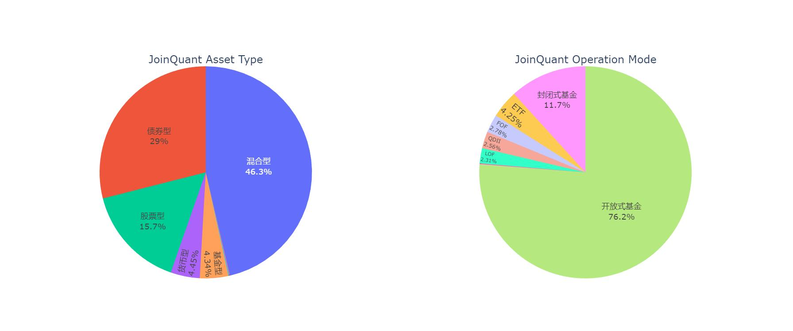

## **I. Data**

**Research**

- Most Data (nav/dividend/split ratio/asset allocation) : `CSMAR`
- Fund classification : `JoinQuant`
- Fund start date: `JoinQuant`

**Validation**

- `AMAC` : [2020 yearly report, page 15](https://www.amac.org.cn/researchstatistics/publication/zgzqtzjjynb/202104/t20210419_11390.html), for market statistic
- `Win.d` : classification/share/nav, for market statistic

**Data is sound, carefully verified and available to fetch**

## **II. Market Statistic**

### 2022-10, proportion of funds

### statistic at the end of June

## **III. Market Return**

### return formula definition

$$
R_t^{real}=\frac{\left(NAV_t+Div_t\right)*s_t}{NAV_{t-1}}\tag{2}
$$

$NAV_t$ denotes net asset value of month t

$Div_t$ denotes dividend payout in month t

$s_t$ denotes split ratio in month t

### cumulative return

## **Note**

if a fund payed dividend multiple times in one month, $Div_t=Div_{t,1}+Div_{t,2}+...$

if a fund was split multiple times in one month, $s_t=s_{t,1}×s_{t,2}×...$

## **Appendix**

### market value statistic validation

### size effect in funds

long-short yield > 0, one-sided t test result

`Ttest_1sampResult(statistic=-0.3712326871145363, pvalue=0.6445771294168032)`

long-short yield > 0, one-sided t test result

`Ttest_1sampResult(statistic=-1.025866442813339, pvalue=0.8469542508537611)`

### errata: seasonal report standard

*problem*: annual report or semi-annual report not available before 2008

*reason*: regulation rule changed

*solve*: use second quarter report if annual of semi-annual report not available

 

[中国证券监督管理委员会公告〔2008〕第4号](http://www.gov.cn/zwgk/2008-02/21/content_896020.htm)

### errata: share data quality

*problem*: 2004 share data lacks

*reason*: data source insufficient

*solve*: use 2005-6 and later data

